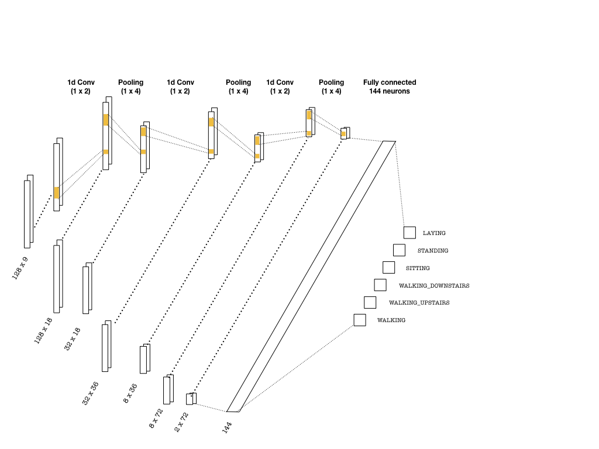
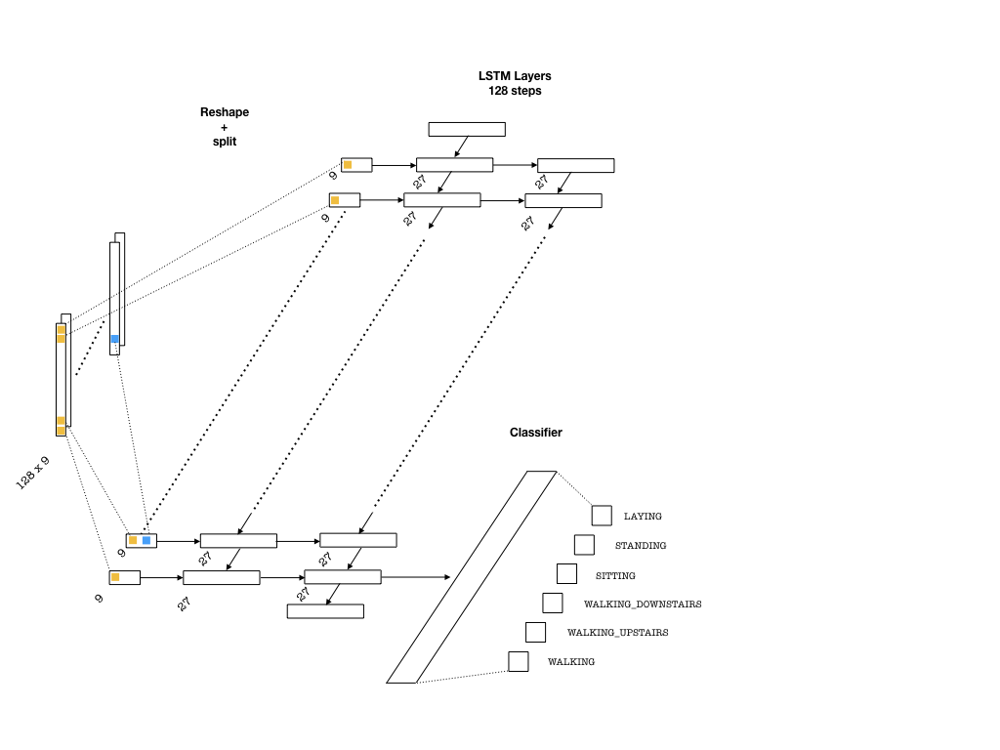

# Human Activity Recognition (HAR)

In this part of the repo, we discuss the human activity recognition problem using deep learning algorithms
and compare the results with standard machine learning algorithms that use engineered features.

The data can be downloaded from the [UCI repository](https://archive.ics.uci.edu/ml/datasets/human+activity+recognition+using+smartphones). 

Please see G.Chevalier's [repo](https://github.com/guillaume-chevalier/LSTM-Human-Activity-Recognition) and A. Saeed's [blog](https://aqibsaeed.github.io/2016-11-04-human-activity-recognition-cnn/) where I have got lots of isnpiration.

## Contents

The `utils` folder contains the code for reading and processing the data into a tensor form. The generated tensors
has the dimensions

```
(batch, seq_len, n_channels)
```

where `batch` is the number of training examples in each batch, `seq_len` is the number of steps in the time series (128) and
`n_channels` is the number of channels where observations are made (9). 

The aim is to clasify the activities correctly, which are

```
1 WALKING
2 WALKING_UPSTAIRS
3 WALKING_DOWNSTAIRS
4 SITTING
5 STANDING
6 LAYING
```

Below are the architectures used for training

Notebook | Description
-------- | ------
[explore_data](https://github.com/bhimmetoglu/seizure-forecast/blob/master/HAR/explore_data.ipynb) | Data exploration
[HAR-LSTM](https://github.com/bhimmetoglu/seizure-forecast/blob/master/HAR/HAR-LSTM.ipynb)    | LSTM network
[HAR-CNN](https://github.com/bhimmetoglu/seizure-forecast/blob/master/HAR/HAR-CNN.ipynb)     | Convolutional neural network(CNN)
[HAR-CNN-LSTM](https://github.com/bhimmetoglu/seizure-forecast/blob/master/HAR/HAR-CNN-LSTM.ipynb) | CNN + LSTM hybrid

## Results

Method   | Test accuracy
------   | -------------
CNN      | 98%
LSTM     | 95%
CNN+LSTM | 95%
[Xgboost](https://rpubs.com/burakh/har_xgb) | 96%

## CNN architecture


## LSTM architecture


